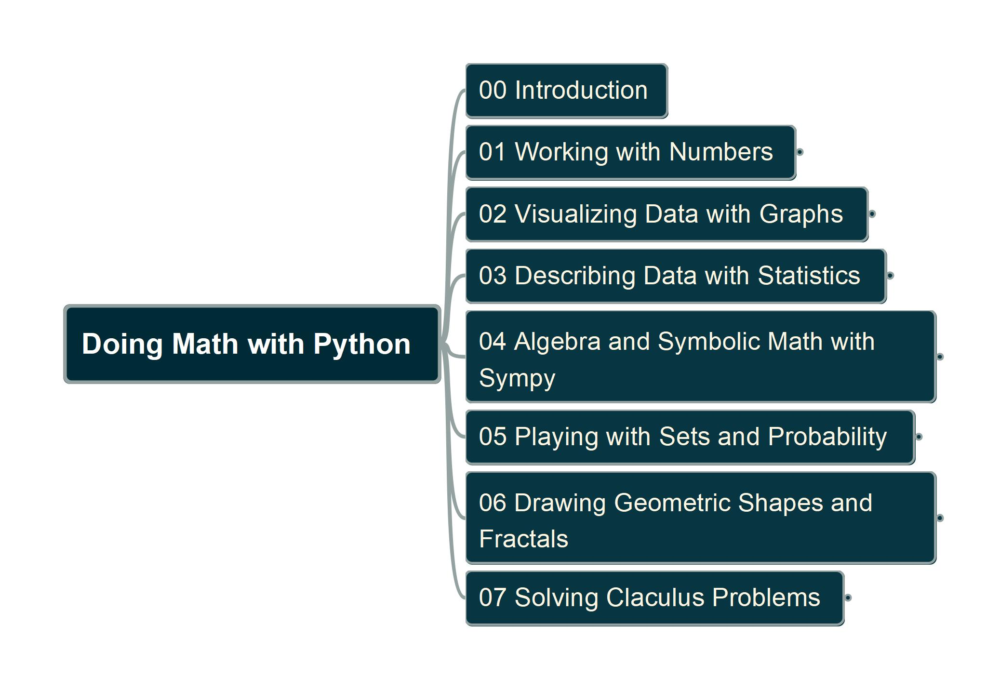

# Doing Math with Python

Learning book "[Doing Math with Python (2015)](https://nostarch.com/doingmathwithpython)" (author: [Amit Saha](https://www.linkedin.com/in/echorand/)) by practicing

---

## Chapter Structure

---

## Videos Link

- [YouTube Video List](https://www.youtube.com/playlist?list=PL6DEHvciXKeXor3p_FvkJaxzMDUgG5UJd)

---

## Chapters Link

- [01 Workign with Numbers](/ch01/)
- 

Welcome to hear from your comments and suggestions, drop me [mail here](mailto:xiaoqizhao@outlook.com).
